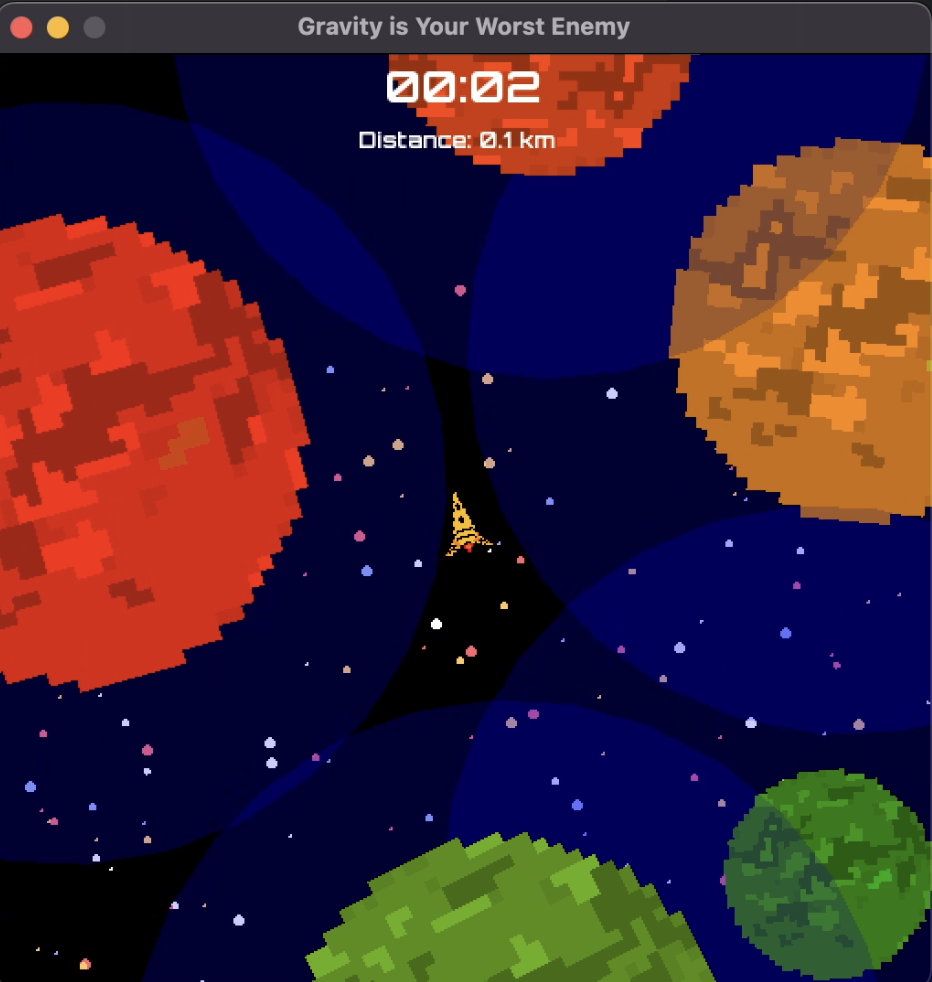
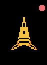
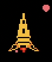
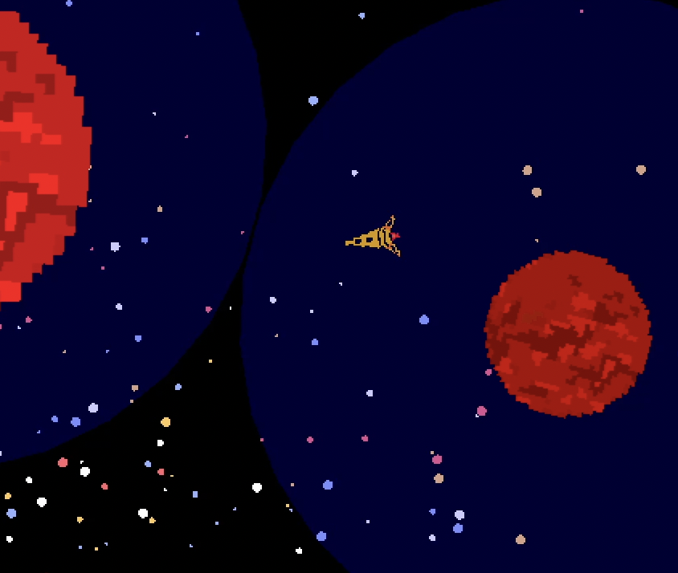
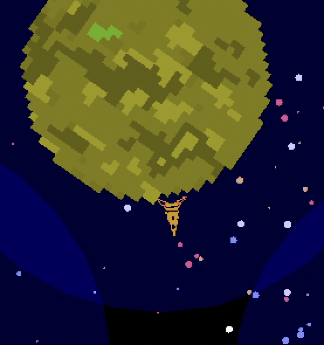
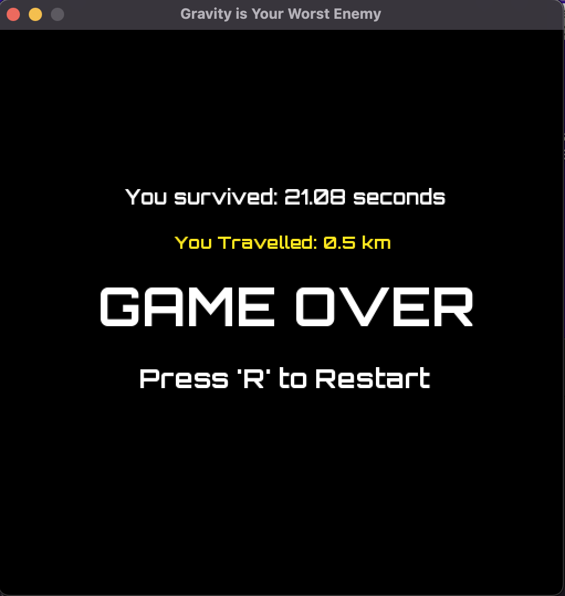

# Gravity is Your Worst Enemy

## Introduction
_"Gravity is Your Worst Enemy"_ is an original lunar landing video game which was created in the span of a month. This project was conceived to familiarize myself with C++ and its vast range of libraries. I wanted to challenge myself to not only understand the intricacies of the language but to also manage and organize a large-scale project and use github. Throughout the development process, I found it very challenging to imitate the nuances of space physics, particularly the inertia and momentum of the rocket ship movement and the complexities of rocket landing on a rotating planet.

## Tech Stack
- **Language**: C++
- **Graphics**: SFML
- **Collisions**: Nick Koirala's Collision file

## Game Mechanics
**Your mission**: Navigate space and travel the furthest distance possible without crashing your ship into any planet. 

- **Ship Movement**: Rotate your ship and thrust forward.

  _Ship with no thrust:_

  

  _Ship with thrust (activated by pressing w):_

  

- **Gravity Fields**: Visible around each planet, they'll pull your ship in.

  _Planet Gravity Field:_

  

- **Landings**: Land with precision on a planet's thruster. Use the planet's rotation for strategic maneuvers. But remember, prolonged survival means faster planet spawn times...

  

- **Game Over**: Reflect on your journey with metrics on distance and survival time.
  

  _Improper Landing:_

  <a href="./assets/readme/improper-landing.mov">Click here to view the "Improper Landing" video</a>

  _Gameover Screen:_

  

## Controls
- **W**: Thrust.
- **A**: Rotate counter-clockwise.
- **D**: Rotate clockwise.

## Sprites
-  pixelartmaker.com 
